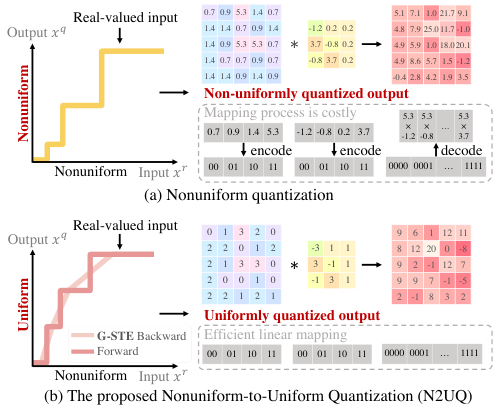
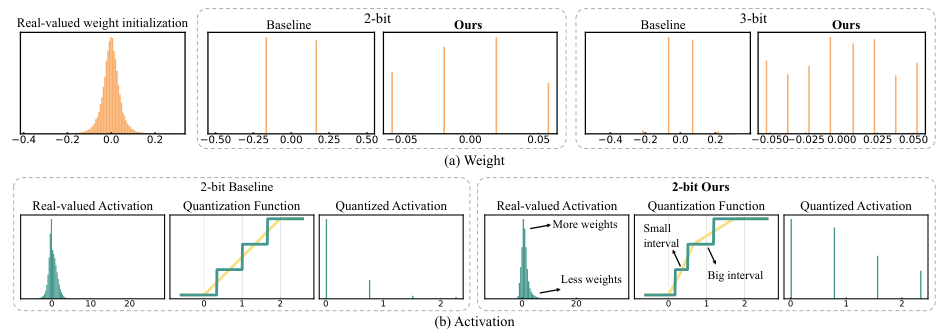
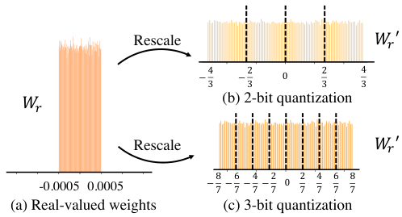
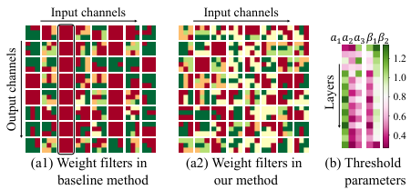

arXiv:2111.14826v2 [cs.CV] 7 Apr 2022

Nonuniform-to-Uniform Quantization: Towards Accurate Quantization via Generalized Straight-Through Estimation

Zechun Liu1,2,4 Kwang-Ting Cheng1 Dong Huang2 Eric Xing2,3 Zhiqiang Shen2,3

1Hong Kong University of Science and Technology 2Carnegie Mellon University
3Mohamed bin Zayed University of Artificial Intelligence 4Reality Labs, Meta Inc.

{zliubq, timcheng}@ust.hk epxing@cs.cmu.edu {dghuang, zhiqians}@andrew.cmu.edu

Abstract

The nonuniform quantization strategy for compressing neural networks usually achieves better performance than its counterpart, i.e., uniform strategy, due to its superior representational capacity. However, many nonuniform quantization methods overlook the complicated projection process in implementing the nonuniformly quantized weights/activations, which incurs non-negligible time and space overhead in hardware deployment. In this study, we propose Nonuniform-to-Uniform Quantization (N2UQ), a method that can maintain the strong representation ability of nonuniform methods while being hardware-friendly and efficient as the uniform quantization for model inference. We achieve this through learning the flexible in-equidistant input thresholds to better fit the underlying distribution while quantizing these real-valued inputs into equidistant output levels. To train the quantized network with learnable input thresholds, we introduce a generalized straight-through estimator (G-STE) for intractable backward derivative calculation w.r.t. threshold parameters. Additionally, we consider entropy preserving regularization to further reduce information loss in weight quantization. Even under this adverse constraint of imposing uniformly quantized weights and activations, our N2UQ outperforms state-of-the-art nonuniform quantization methods by 0.5~1.7% on ImageNet, demonstrating the contribution of N2UQ design. Code and models are available at: https://github.com/liuzechun/Nonuniform-to-Uniform-Quantization.

1. Introduction

Deep Neural Networks (DNNs) have demonstrated great success in various real-world applications [18, 43]. Despite their remarkable results, the large model size and high computational cost hinder pervasive deployment of DNNs, especially on resource-constrained devices. A number of

Figure 1. (a) Previous nonuniform quantization function outputs weights and activations in in-equidistant levels, which requires the post-processing of mapping floating-point levels to binary digits in order to obtain the speed-up effect of quantization [1, 13, 52]. (b) The proposed N2UQ learns input thresholds to allow more flexibility, while outputs uniformly quantized values, enabling hardware-friendly linear mappings and efficient bitwise operations. The intractable gradient computation w.r.t. input thresholds is tackled with the proposed generalized straight-through estimator (G-STE).

approaches have been proposed to compress and accelerate DNNs, including channel pruning [29, 31], quantization [33, 49, 52], neural architecture search [6, 45], etc.

Among these methods, quantization-based methods have shown promising results in compressing the model size by representing weights with fewer bits, and faster inference by replacing computationally-heavy convolution operations with efficient bitwise operations [38, 49]. Despite these advantages, quantized DNNs still have a non-negligible performance gap from their full-precision counterparts, especially with extremely low-bit quantization. For example,

the 2-bit classic uniformly quantized ResNet-50 achieves 67.1% top-1 accuracy [52] on ImageNet dataset, a drop of 9.9% compared to a real-valued ResNet-50. This performance gap mainly results from the quantization error in representing real-valued weights and activations with a limited number of quantized levels and the inflexibility for uniform quantizers to adapt to different distributions of input values.

To better fit underlying distributions and mitigate quantization errors, several previous studies proposed nonuniform quantization by adjusting the quantization resolution according to the density of real-valued distribution [48, 49]. However, the accuracy improvement of nonuniform quantization usually comes at the expense of hardware implementation efficiency [13, 52]. Since the output of the nonuniform quantization are floating-point weights and activations, their multiplication can no longer be directly accelerated by the bitwise operation between binaries [24]. A common solution to address this issue has been building look-up tables (LUTs) to map floating-point values to binary digits [16, 48], as shown in Fig. 1(a). This post-processing incurred by nonuniform quantization costs more hardware area and consumes additional energy compared to uniform quantization [1, 13].

The goal of this study is to develop a new quantization method maintaining the hardware projection simplicity as uniform quantization and meanwhile offering the flexibility to achieve the merit on performance of nonuniform quantization. Despite that it is desirable to enforce a quantizer's outputs (i.e., quantized weights/activations) to have uniform quantization levels in order not to incur additional post-processing tasks, each of the output levels does not necessarily need to represent an equal range of the real-valued input. As shown in Fig. 1 (b), we enforce the output quantization levels to be equidistant while learning the thresholds on the input values to incorporate more flexibility in fitting the underlying real-valued distributions for quantization. We name this quantizer design as Nonuniform-to-Uniform Quantizer (N2UQ).

However, it is challenging to optimize such a non-uniform-to-uniform quantizer, which can automatically learn to adapt the input thresholds through network training for higher precision. Because the gradient computation w.r.t. the threshold parameters is intractable, and cannot be resolved by the existing gradient estimation method for quantization, i.e., the straight-through estimator (STE) [2]. STE simply estimates the incoming gradient to a threshold operation to be equal to the outgoing gradient, which by definition is unable to incorporate the threshold difference in training neither to update the threshold with gradients.

To circumvent this challenge, we revisit the earliest derivation of STE from the stochastic binarization [2] and derive a novel and more flexible backward approximation method for quantization. We name it as Generalized

Straight-Through Estimator (G-STE). It degenerates to STE when all the input intervals are equal-sized, while for the scenarios that require nonuniform input thresholds, it automatically adapts the thresholds with gradient learning and provides a finer-grained approximation to the quantization function. Specifically, G-STE encodes the expectation of stochastic quantization into the backward approximation to the forward deterministic quantization functions, which naturally converts the intractable gradient computation w.r.t. the input threshold parameters to that w.r.t. the slopes, and encodes the influence from input threshold difference to the remaining network in the backward gradient computation.

Moreover, we propose the weight regularization that considers the overall entropy in a weight filter to further reduce the information loss arising from weight quantization. We extensively evaluate the effectiveness of the proposed N2UQ with the collective contributions of the threshold-learning quantizer via G-STE and the weight regularization on ImageNet with different architectures and different bit-width constraints. Under all deployment scenarios, N2UQ consistently improves the accuracy by a significant margin compared to the state-of-the-art methods, including both uniform and nonuniform quantization.

The contribution of this paper includes four aspects:

* We propose Nonuniform-to-Uniform Quantizer (N2UQ) for improving the quantization precision via learning input thresholds, while maintaining hardware-friendliness in implementation similar to uniform quantization.
* We propose Generalized Straight-Through Estimator (G-STE) to tackle intractable gradient computation w.r.t. input threshold parameters in N2UQ. G-STE calculates the expectation of the stochastic quantization as the backward approximation to the forward deterministic quantization.
* Based on entropy analysis, we propose a novel weight regularization considering the overall weight distribution for further preserving information in weight quantization.
* We demonstrate that even under the strict constraint of fixing the quantized weights and activations to be uniform and only learning input thresholds, N2UQ exceeds state-of-the-art nonuniform quantization method with 0.5~1.7% higher accuracy on ImageNet. Specifically, the 2-bit ResNet-50 model achieves 76.4% top-1 accuracy on ImageNet, reducing the gap to its real-valued counterpart to only 0.6%, demonstrating the effectiveness of N2UQ design.

## 2. Related Work

Model compression is a useful technology for deploying neural network models to mobile devices with limited storage and computational power [5, 6], and has attracted increasing attention. Model compression methods can be categorized into several major categories, including quantization [33, 49, 52, 55], pruning [11, 29, 31], knowledge distillation [19, 42], compact network design [20, 34, 41, 50],

etc. This work is mainly focused on quantization.

Quantization can be further classified to uniform quantization [7, 8, 15, 21, 22, 52] and nonuniform quantization [28, 36, 48, 49]. Compared to uniform approaches, nonuniform quantization may achieve higher accuracy because it can better capture the underlying distributions by learning to allocate more quantization levels to important value regions [13]. For example, PoT [36] uses powers-of-two levels and ApoT [28] further proposed additive powers-of-two quantization. However, it is typically difficult to deploy nonuniform quantization efficiently on the general-purpose hardware [48], e.g., GPU and CPU. Since to accelerate nonuniform quantization with bitwise operations requires additional operations or designs like look-up tables (LUTs) for mapping between floating-point quantization outputs and their binary digit representations [16, 24], which is less efficient compared to uniform quantization. Our proposed N2UQ is motivated to combine the merits of uniform and nonuniform quantization by outputting uniformly quantized levels for hardware-friendly implementation while allowing effective input thresholds learning to fit the underlying distributions for higher accuracy.

Moreover, the quantization function is intrinsically a discontinuous step function and nearly always has zero gradients w.r.t. inputs. To circumvent this problem, early work proposed straight-through estimation (STE) [2] for gradient estimation, which is widely adopted in subsequent quantization methods [8, 12, 21, 48, 49, 52, 55]. However, STE simply backpropagates through the hard threshold function as if it had been the identity function, which is unable to incorporate non-linearities in quantizer's input and output to fit various distributions. To deal with this restriction, previous works manually add non-linear functions before and/or after the STE-based quantizer. For example, LCQ [48] adds compressing and expanding function to STE-based quantizer to achieve nonuniform quantization. QIL [25] proposes to learn a power function before the STE-based quantizer for controlling quantization interval sizes. However, these methods relying on STE suffer from the discrepancy between quantizer's thresholds and nonlinear function's turning points [48] or the inflexibility of using a human-defined smooth function to control all the quantization intervals with a single power hyper-parameter [25]. To overcome this limitation, we proposed Generalized Straight-Through Estimator (G-STE) to incorporate flexible non-linearity learning inside the quantizer, as detailed in Sec. 3.

## 3. Method

In this section, we first briefly introduce the objective of quantization in Sec. 3.1. Then we present our nonuniform-to-uniform quantization (N2UQ) in Sec. 3.2 with three components: threshold learning quantizer in the forward pass in Sec. 3.2.1, its backward approximation with Generalized

Straight-Through Estimator (G-STE) in Sec. 3.2.2 and an additional weight regularization method in Sec. 3.2.3.

### 3.1. Preliminaries

Matrix multiplication is the most computation-costly operation in deep neural networks. By quantizing the weights and activations in the convolutional layers and fully connected layers to fixed bits, the matrix multiplication can be accelerated with bitwise operations [49, 52]:

$$
a^q \cdot w^q = \sum_{i=0}^{M-1} \sum_{j=0}^{K-1} 2^{i+j} \text{popcnt}[\text{and}(\mathbf{a}_i, \mathbf{w}_j)], \quad (1) \\ \mathbf{a}_i, \mathbf{w}_j \in \{0, 1\} \quad \forall i \in \{0, 1, \dots, M-1\}, j \in \{0, 1, \dots, K-1\}.
$$

Here $\mathbf{a}$ and $\mathbf{w}$ are binary vectors of the quantized activation $a^q$ and quantized weight $w^q$. $M$ and $K$ denote the number of bits used in representing $a^q$ and $w^q$, respectively. While Eq. 1 in general holds true for uniform quantization, the situation becomes complicated when considering the nonuniform quantization.

### 3.2. Nonuniform-to-Uniform Quantization

To sort out the inner mechanism of quantization, we summarize two properties of the quantizer:

**Property 1 (Quantizer's output).** The premise of quantized network being accelerated with Eq. 1 is that the quantizer's output (i.e., quantized weights $w^q$ and activations $a^q$) can be represented in OR mapped to binary digits within the fixed bits: $a^q = \sum_{i=0}^{M-1} \mathbf{a}_i 2^i$, $w^q = \sum_{j=0}^{K-1} \mathbf{w}_j 2^j$ [52].

This property is straightforward since Eq. 1 takes place between binary vectors. While uniformly quantized $a^q$ and $w^q$ can be easily converted to binaries via linear mappings, it usually requires additional operations [28] or look-up tables (LUTs) [16, 48] for encoding 'n-bit' nonuniformly quantized $a^q$ and $w^q$ to n-bit binary digits, because outputs of n-bit nonuniform quantizer are actually $2^n$ in-equidistant floating-point values, as illustrated in Fig. 1. This post-processing step incurs larger hardware area and more energy consumption as mentioned in hardware studies [1, 23].

**Property 2 (Quantizer's input):** The uniformness in input and output levels of the quantization function $x^q = F_Q(x^r)$ can be detached through a proper quantizer design, i.e., uniform quantization levels in output $x^q$ do not necessarily need to represent uniform ranges from the input $x^r$.

This property originates from the observation that the quantizer represents real-valued variables $x^r$ with several quantized levels $x^q$, while the quantized levels are fixed, the real-valued distributions are diverse. Thus, allowing learnable thresholds in dividing $x^r$ to fixed quantized levels $x^q$ theoretically can incorporate more representational flexibility for achieving higher precision.

### 3.2.1 Forward Pass: Threshold Learning Quantization

Based on these two properties, we develop nonuniform-to-uniform quantizer (N2UQ) for activation quantization, with its forward pass formulated as:

$$
x^q = \begin{cases} 0 & x^r < T_1 \\ 1 & T_1 \le x^r < T_2 \\ \dots & \dots \\ 2^n - 1 & x^r \ge T_{2^n-1} \end{cases}, \quad (2)
$$

where $n$ is the number of bits, $T$ represents learnable thresholds, and $x^r$, $x^q$ represent the input real-valued variables and the output quantized variables, respectively. The goal of N2UQ is to encode threshold learning in the quantizer to allow more flexibility, while output uniformly quantized weights and activations to accommodate fast bitwise operations without the post-processing step between quantization and matrix multiplication.

### 3.2.2 Backward Pass: Generalized Straight-Through Estimator (G-STE)

However, backpropagating through Eq. 2 is difficult because: (I) The derivatives of Eq. 2 w.r.t. input $x^r$ are almost zero everywhere. (II) The gradient calculation w.r.t. threshold parameters is intractable.

For challenge (I), previous quantization works adopt straight-through estimator (STE) to approximate the backward gradients in the quantization functions [8, 21, 30, 46, 48, 52]. STE simply assigns the incoming gradients to a threshold operation to be the outgoing gradients:

$$
\frac{\partial \mathcal{L}}{\partial x_{i,l}^q} = \frac{\partial \mathcal{L}}{\partial x_{i,l}^r} \quad (3)
$$

$x_{i,l}^q$ and $x_{i,l}^r$ denote the $i^{th}$ quantized / real-valued variables in $l^{th}$ layer, respectively. This simple approximation function works well for uniform quantizers. However, STE implicitly enforces the equal axis aspect ratio in the input and output intervals of the quantizer because it regards the quantization function as an identity function in the backward pass. This obstacles the quantizer design from allowing learnable input thresholds while fixing the output levels. Moreover, STE cannot deal with challenge (II), gradient computation w.r.t. learnable thresholds since STE basically just bypasses the gradients as if the quantization function does not exist. Thus, to come up with a finer-grained and more flexible backward approximation that can tackle the gradient computation w.r.t. input thresholds, we revisit STE in stochastic binarization and derive the proposed Generalized Straight-Through Estimator (G-STE).

**Lemma 1.** In binarization, straight-through estimation (STE) for gradient approximation to the forward deterministic binarization function can be derived from the expectation of the stochastic binarization function [21].

The concept of stochastic binarization and deterministic binarization are first proposed in [2, 9, 10]. In stochastic binarization, real-valued variables are binarized to $-1/1$ stochastically according to their distances to $-1/1$:

$$
\tilde{x}_{i,l}^b = \begin{cases} -1 & \text{with probability } p = \text{clip}(\frac{1-x_{i,l}^r}{2}, 0, 1) \\ 1 & \text{with probability } p = \text{clip}(\frac{1+x_{i,l}^r}{2}, 0, 1) \end{cases}, \quad (4)
$$

where $\tilde{x}_{i,l}^b$ denotes the stochastic binary variables. To update $W_{ij,l}$ (weights in layer $l$ connecting neuron $j$ in layer $l-1$ to neuron $i$ in layer $l$), the expected gradients through the stochastic binarization function are computed:

$$
\mathbb{E}[\frac{\partial \mathcal{L}}{\partial W_{ij,l}}] = \mathbb{E}_{/\tilde{x}_{i,l}^b}[\frac{\partial \mathcal{L}}{\partial \tilde{x}_{i,l}^b} \mathbb{E}_{\tilde{x}_{i,l}^b}[\frac{\partial \tilde{x}_{i,l}^b}{\partial x_{i,l}^r} \frac{\partial x_{i,l}^r}{\partial W_{ij,l}}]], \quad (5)
$$

where $\mathbb{E}$, $\mathbb{E}_{/\tilde{x}_{i,l}^b}$ and $\mathbb{E}_{\tilde{x}_{i,l}^b}$ are respectively, the expectation over the whole network, only the stochastic binary variables and other parts except the stochastic binary variables. Specifically,

$$
\begin{aligned} \mathbb{E}_{\tilde{x}_{i,l}^b}[\frac{\partial \tilde{x}_{i,l}^b}{\partial x_{i,l}^r}] &= \frac{\partial}{\partial x_{i,l}^r} \mathbb{E}[\tilde{x}_{i,l}^b] \\ &= \frac{\partial}{\partial x_{i,l}^r}(-1 \times p_{\{\tilde{x}_{i,l}^b=-1\}} + 1 \times p_{\{\tilde{x}_{i,l}^b=1\}}) \quad (6) \\ &= \frac{\partial}{\partial x_{i,l}^r}(\text{clip}(x_{i,l}^r, -1, 1)) \end{aligned}
$$

This arrives at the common straight-through estimator for the binarization functions [3, 38, 53], which transmits the gradients identically near the threshold and disregards the gradients when the real-valued inputs are too far from the threshold (i.e., $x^r > 1$ or $x^r < -1$). Meanwhile, the widely-adopted deterministic binarization function in forward pass [4, 9, 30, 32, 33] can be attained via setting a hard threshold on the probability (i.e., $p = 0.5$) in Eq. 4:

$$
x_{i,l}^b = \begin{cases} -1 & p_{\{\tilde{x}_{i,l}^b=-1\}} > 0.5 \\ 1 & p_{\{\tilde{x}_{i,l}^b=-1\}} \le 0.5 \end{cases} = \begin{cases} -1 & x_{i,l}^r < 0 \\ 1 & x_{i,l}^r \ge 0 \end{cases} \quad (7)
$$

To this end, we show that STE encodes the expectation of stochastic binarization in the backward approximation to the forward deterministic binarization functions.

**Lemma 2.** A quantization function $x^q$ can be regarded as a summation of binarization functions $x^b$ with different thresholds: $x^q = x_{\text{thre}_1}^b + x_{\text{thre}_2}^b + \dots + x_{\text{thre}_n}^b$.

This lemma is self-evident, as illustrated in Fig. 2 (b). From here, we extend the concept of stochastic binarization to quantization for deriving G-STE to solve the threshold learning problem in nonuniform-to-uniform quantizer.

We start with the first quantization segment. We denote the initial point as $s$ and its length as $a_1$. For simplification, we omit the subscripts here. Following the concept

Figure 2. (a) The deterministic binarization function and straight-through estimation (STE) as the backward approximation. (b) Quantization can be viewed as a summation of segments of binarization functions, which derives the proposed generalized straight-through estimator (G-STE).

of stochastic binarization, in the range of $[s, s + a_1]$, real-valued variables can be quantized to 0/1 stochastically with the probability proportional to their distance to $s/s + a_1$:

$$
\tilde{x}^{q\{0,1\}} = \begin{cases} 0 & \text{with probability } p = \text{clip}\left(\frac{s+a_1-x^r},{a_1}, 0, 1\right) \\ 1 & \text{with probability } p = \text{clip}\left(\frac{x^r-s},{a_1}, 0, 1\right) \end{cases}, \quad (8)
$$

$\tilde{x}^{q\{0,1\}}$ is the stochastic quantization output within this segment. Similar to Eq. 6, the derivation of this quantization segment can be computed from the expectation of Eq. 8:

$$
\begin{aligned} \mathbb{E}\left[\frac{\partial \tilde{x}^{q\{0,1\}}},{\partial x^r}\right] &= \frac{\partial},{\partial x^r} \mathbb{E}[\tilde{x}^{q\{0,1\}}] \\ &= \frac{\partial},{\partial x^r} \left(0 \times p_{\{\tilde{x}^q=0\}} + 1 \times p_{\{\tilde{x}^q=1\}}\right) \quad (9) \\ &= \frac{\partial \text{clip}\left(\frac{x^r-s},{a_1}, 0, 1\right)},{\partial x^r}. \end{aligned}
$$

In this way, the influence of the threshold parameter $a_1$ to the network is decently encoded in the backward approximation function Eq. 9 by altering the slopes. Further in the forward pass, instead of using stochastic quantization which requires random seeds generating process [44], deterministic quantization are adopted and derived by setting the probability threshold to be $p = 0.5$,

$$
x^{q\{0,1\}} = \begin{cases} 0 & p_{\{\tilde{x}^q=0\}} > 0.5 \\ 1 & p_{\{\tilde{x}^q=0\}} \le 0.5 \end{cases} = \begin{cases} 0 & x^r < s + \frac{a_1},{2} \\ 1 & x^r \ge s + \frac{a_1},{2} \end{cases}. \quad (10)
$$

Likewise, the forward deterministic quantization functions and the corresponding backward approximation functions for the remaining segments can be obtained from this probabilistic sense. Then, the nonuniform-to-uniform quantizer with its backward approximation for $n$-bit quantization can

be naturally derived by summing up $2^n - 1$ segments, as illustrated in Fig. 2. We name this proposed backward gradient approximation method as Generalized Straight-Through Estimator (G-STE) and obtain the following theorem.

**Theorem 1** Generalized straight-through estimator:

### 3.2.3 Entropy Preserving Weight Regularization

Further, we propose weight regularization to encourage more information-carrying capacity in quantized weights. An important observation is that weights in real-valued networks are usually small in magnitude, e.g, $\sim 10^{-2}$ for weights in a pre-trained ResNet-18 network, but the quantized weights usually expand in the range of $[-1, 1]$. This mismatch in magnitude will cause quantized weights to collapse to a few quantization levels close to zero. The classic solution is using a tanh function and dividing the maximum absolute weight value to rescale weights to $[-1, 1]$ [52]. However, these rescaled weights are likely to be dominant by a few extrema and still not fully occupy the range of $[-1, 1]$, as will further be illustrated in Fig. 3, which causes a huge information loss.

From the perspective of information theory, more information are preserved when quantized weights contain higher entropy. Thus, we are motivated to regularize the real-valued weights before the quantizer to obtain maximal entropy in quantized weights: $\max \mathcal{H} = -p_i \log(p_i)$, s.t. $\sum_{i=1}^{N} p_i = 1$. Here $p_i$ is the proportion of real-valued weights being quantized to $i^{th}$ quantization level and $N$ is the number of quantization levels in total. Based on the Lagrange multiplier, it is easy to obtain the optimal $p_i^* = \frac{1}{N}$, $i \in \{1, 2, \dots, N\}$, meaning that, when the proportions of real-valued weights being quantized to multiple quantization levels are equal, the information entropy in the quantized weights reaches its maximum value.

Given the quantization function $F_Q = round((\text{clip}(w^{r'}, -1, 1) + 1) \times \frac{2^{n-1}}{2}) \times \frac{2}{2^{n-1}} - 1$, we empirically solve that when real-valued weights are normalized to $W^{r'} = \frac{2^{n-1}}{2^{n-1}} \frac{|W^r|}{||W^r||_{t1}} W^r$, the corresponding quantized weights $w^q = F_Q(w^{r'}, n)$ are approximately uniformly distributed in all quantization levels. Here, $W^r$ is the real-valued weight filter, $|W^r|$ denotes the number of entries in $W^r$. Different from activations that are generated from images and vary from batch to batch, weights are static parameters that have high flexibility to adjust each of their values. Therefore, instead of learning the threshold parameters to determine all the quantized weights values, we adopt equidistant thresholds for weight quantization, letting each weight individually learn its value and scale the weights based on the overall statistics. More details of the derivation can be found in Appendix.

## 4. Experiments

To verify the effectiveness of the proposed Nonuniform-to-Uniform Quantization (N2UQ), we conduct experiments on the ImageNet dataset. We first introduce the dataset and training strategy in Sec. 4.1, followed by the comparison to state-of-the-art quantization methods in Sec. 4.2. We then

analyze the effect of each proposed component of N2UQ in Sec. 4.3. Visualization results on how N2UQ captures fine-grained underlying distributions are presented in Sec. 4.4.

### 4.1. Experimental Settings

**Dataset** The experiments are carried out on the ImageNet-2012 classification dataset [39], with 1.2 million training images and 50,000 validation images in 1000 classes.

**Training Strategy** We follow the training scheme in [12, 25, 48, 52] to use real-valued PyTorch pre-trained models as initialization for corresponding quantized networks. We use Adam optimizer [26] with a linear learning rate decay scheduler. The initial learning rate is set to $2.5e-3$ for weight parameters and batch size is set to 512. We set weight decay to be 0 following [32, 33]. The models are trained for 128 epochs with the same knowledge distillation scheme as LSQ [12]. We adopt the basic data augmentation as ResNet [18]. Training images are randomly resized and cropped to $224 \times 224$ pixels and randomly flipped horizontally. Test images are center-cropped to $224 \times 224$ pixels. For fair comparison, the floating-point (FP) model results reported in Table 1 are initialized and fine-tuned with the same settings as quantized models.

**Learnable Parameters** For the learnable parameters, $s$ are initialized to 0, $a_i$ are initialized to $2/(2^n-1)$ and enforced to be greater than $1e-3$. The learnable scaling parameters $\beta_1, \beta_2$ are initialized to 1. All these learnable parameters use $1/10$ of the learning rate as that for weight parameters.

**Network Structure** We adopt Pre-Activation structures (i.e., NonLinear-Conv-BN structure) and use RPReLU [32] as non-linear function. All convolution and fully-connected layers are quantized with N2UQ except for the first and the last one.

### 4.2. Comparison with State-of-the-Art Methods

Table 1 summarizes the accuracy of the proposed N2UQ on ResNet. Compared to uniform quantization, N2UQ allows more flexibility in learning input thresholds, and the results demonstrate that N2UQ surpasses uniform methods [8, 12, 15, 52] by a large margin. Moreover, the accuracy improvements become more significant with larger bit-width, as more flexibility can be incorporated with threshold learning. For nonuniform quantization, the state-of-the-art method LCQ [48] intrinsically uses the same quantizer as the classic uniform quantizer [8, 52] and learns two additional non-linear functions to reshape the real-valued input and quantized output. Instead, the proposed N2UQ completely integrates the non-linearity learning inside the quantizer, which avoids the discrepancy between the non-linear functions' turning points and the quantizers' thresholds. Thus, the proposed N2UQ achieves up to 1.7% higher accuracy than LCQ, showing that N2UQ is well designed to incorporate threshold learning into the quantizers for

Table 1. Accuracy comparison to the state-of-the-art quantization methods with ResNet structure on ImageNet dataset. Note that W/A denote the bit-width of weights and activations, respectively. FP denotes the top-1 accuracy of the full-precision models.

<table><thead><tr><th rowspan="2">Network</th><th rowspan="2">Method</th><th>Bit-width</th><th colspan="2">Accuracy(%)</th><th>Bit-width</th><th colspan="2">Accuracy(%)</th><th>Bit-width</th><th colspan="2">Accuracy(%)</th></tr><tr><th>(W/A)</th><th>Top-1</th><th>Top-5</th><th>(W/A)</th><th>Top-1</th><th>Top-5</th><th>(W/A)</th><th>Top-1</th><th>Top-5</th></tr></thead><tbody><tr><td rowspan="11">ResNet-18 (FP: 71.8)</td><td>PACT [8]</td><td>2/2</td><td>64.4</td><td>85.6</td><td>3/3</td><td>68.1</td><td>88.2</td><td>4/4</td><td>69.2</td><td>89.0</td></tr><tr><td>DoReFa-Net [52]</td><td>2/2</td><td>64.7</td><td>84.4</td><td>3/3</td><td>67.5</td><td>87.6</td><td>4/4</td><td>68.1</td><td>88.1</td></tr><tr><td>LQ-Nets [49]</td><td>2/2</td><td>64.9</td><td>85.9</td><td>3/3</td><td>68.2</td><td>87.9</td><td>4/4</td><td>69.3</td><td>88.8</td></tr><tr><td>DSQ [15]</td><td>2/2</td><td>65.2</td><td>—</td><td>3/3</td><td>68.7</td><td>—</td><td>4/4</td><td>69.6</td><td>88.9</td></tr><tr><td>FAQ [35]</td><td>—</td><td>—</td><td>—</td><td>—</td><td>—</td><td>—</td><td>4/4</td><td>69.8</td><td>89.1</td></tr><tr><td>QIL [25]</td><td>2/2</td><td>65.7</td><td>—</td><td>3/3</td><td>69.2</td><td>—</td><td>4/4</td><td>70.1</td><td>—</td></tr><tr><td>DAQ [27]</td><td>2/2</td><td>66.9</td><td>—</td><td>3/3</td><td>69.6</td><td>—</td><td>4/4</td><td>70.5</td><td>—</td></tr><tr><td>DNAS [46]</td><td>—</td><td>—</td><td>—</td><td>—</td><td>—</td><td>—</td><td>~4/~4</td><td>70.6</td><td>—</td></tr><tr><td>APoT [28]</td><td>2/2</td><td>67.3</td><td>87.5</td><td>3/3</td><td>69.9</td><td>89.2</td><td>4/4</td><td>70.7</td><td>89.6</td></tr><tr><td>LSQ [12]</td><td>2/2</td><td>67.6</td><td>87.6</td><td>3/3</td><td>70.2</td><td>89.4</td><td>4/4</td><td>71.1</td><td>90.0</td></tr><tr><td>LCQ [48]</td><td>2/2</td><td>68.9</td><td>—</td><td>3/3</td><td>70.6</td><td>—</td><td>4/4</td><td>71.5</td><td>—</td></tr><tr><td colspan="2"><b>N2UQ (Ours)</b></td><td>2/2</td><td><b>69.4</b></td><td><b>88.4</b></td><td>3/3</td><td><b>71.9</b></td><td><b>90.5</b></td><td>4/4</td><td><b>72.9</b></td><td><b>90.9</b></td></tr><tr><td rowspan="10">ResNet-34 (FP: 74.9)</td><td>LQ-Nets [49]</td><td>2/2</td><td>69.8</td><td>89.1</td><td>3/3</td><td>71.9</td><td>90.2</td><td>—</td><td>—</td><td>—</td></tr><tr><td>DSQ [15]</td><td>2/2</td><td>70.0</td><td>—</td><td>3/3</td><td>72.5</td><td>—</td><td>4/4</td><td>72.8</td><td>—</td></tr><tr><td>FAQ [35]</td><td>—</td><td>—</td><td>—</td><td>—</td><td>—</td><td>—</td><td>4/4</td><td>73.3</td><td>91.3</td></tr><tr><td>QIL [25]</td><td>2/2</td><td>70.6</td><td>—</td><td>3/3</td><td>73.1</td><td>—</td><td>4/4</td><td>73.7</td><td>—</td></tr><tr><td>APoT [28]</td><td>2/2</td><td>70.9</td><td>89.7</td><td>3/3</td><td>73.4</td><td>91.1</td><td>4/4</td><td>73.8</td><td>91.6</td></tr><tr><td>DAQ [27]</td><td>2/2</td><td>71.0</td><td>—</td><td>3/3</td><td>73.1</td><td>—</td><td>4/4</td><td>73.7</td><td>—</td></tr><tr><td>DNAS [46]</td><td>—</td><td>—</td><td>—</td><td>—</td><td>—</td><td>—</td><td>~4/~4</td><td>74.0</td><td>—</td></tr><tr><td>LSQ [12]</td><td>2/2</td><td>71.6</td><td>90.3</td><td>3/3</td><td>73.4</td><td>91.4</td><td>4/4</td><td>74.1</td><td>91.7</td></tr><tr><td>LCQ [48]</td><td>2/2</td><td>72.7</td><td>—</td><td>3/3</td><td>74.0</td><td>—</td><td>4/4</td><td>74.3</td><td>—</td></tr><tr><td colspan="2"><b>N2UQ (Ours)</b></td><td>2/2</td><td><b>73.3</b></td><td><b>91.2</b></td><td>3/3</td><td><b>75.2</b></td><td><b>92.3</b></td><td>4/4</td><td><b>76.0</b></td><td><b>92.8</b></td></tr><tr><td rowspan="9">ResNet-50 (FP: 77.0)</td><td>DoReFa-Net [52]</td><td>2/2</td><td>67.1</td><td>87.3</td><td>3/3</td><td>69.9</td><td>89.2</td><td>4/4</td><td>71.4</td><td>89.8</td></tr><tr><td>LQ-Nets [49]</td><td>2/2</td><td>71.5</td><td>90.3</td><td>3/3</td><td>74.2</td><td>91.6</td><td>4/4</td><td>75.1</td><td>92.4</td></tr><tr><td>FAQ [35]</td><td>—</td><td>—</td><td>—</td><td>—</td><td>—</td><td>—</td><td>4/4</td><td>76.3</td><td>93.0</td></tr><tr><td>PACT [8]</td><td>2/2</td><td>72.2</td><td>90.5</td><td>3/3</td><td>75.3</td><td>92.6</td><td>4/4</td><td>76.5</td><td>93.2</td></tr><tr><td>APoT [28]</td><td>2/2</td><td>73.4</td><td>91.4</td><td>3/3</td><td>75.8</td><td>92.7</td><td>4/4</td><td>76.6</td><td>93.1</td></tr><tr><td>LSQ [12]</td><td>2/2</td><td>73.7</td><td>91.5</td><td>3/3</td><td>75.8</td><td>92.7</td><td>4/4</td><td>76.7</td><td>93.2</td></tr><tr><td>Auxi [54]</td><td>2/2</td><td>73.8</td><td>91.4</td><td>3/3</td><td>75.4</td><td>92.4</td><td>—</td><td>—</td><td>—</td></tr><tr><td>LCQ [48]</td><td>2/2</td><td>75.1</td><td>—</td><td>3/3</td><td>76.3</td><td>—</td><td>4/4</td><td>76.6</td><td>—</td></tr><tr><td colspan="2"><b>N2UQ (Ours)</b></td><td>2/2</td><td><b>75.8</b></td><td><b>92.3</b></td><td>3/3</td><td><b>77.5</b></td><td><b>93.6</b></td><td>4/4</td><td><b>78.0</b></td><td><b>93.9</b></td></tr></tbody></table>

Table 2. Accuracy comparison with MobileNet structure.

<table><thead><tr><th>Network</th><th>Method</th><th>Top1 Acc (%)</th><th>Top5 Acc (%)</th></tr></thead><tbody><tr><td rowspan="5">MobileNet-V2 (FP: 72.0)</td><td>DSQ [15]</td><td>64.8</td><td>—</td></tr><tr><td>LLSQ [51]</td><td>67.4</td><td>88.0</td></tr><tr><td>LCQ [48]</td><td>70.8</td><td>89.7</td></tr><tr><td>PROFIT [37]</td><td>71.6</td><td>90.4</td></tr><tr><td><b>N2UQ (Ours)</b></td><td><b>72.1</b></td><td><b>90.6</b></td></tr></tbody></table>

higher flexibility and better performance. Moreover, compared to nonuniform quantization, N2UQ not only saves the parameters by fixing the output levels, but also results in uniformly quantized weights and activations for computing the quantized matrix multiplication, which prevents the post-processing step of building look-up tables (LUTs) and mapping the floating-point levels to binaries, thus is much more hardware-friendly [13, 22, 24]. For the MobileNetV2 structure, N2UQ also achieves the state-of-the-art result as shown in Table 2. It is remarkable that N2UQ can compress the real-valued network to 4-bit without compromising

or even improving the accuracy, indicating that deep neural network structures have redundancy and N2UQ is well-designed to fit underlying distributions and act as a good regularization to prevent overfitting as well [16].

4.3. Ablation Study

To investigate the effect of each component on the final performance, we conduct thorough ablation studies on the 2-bit quantized ResNet-18 network on ImageNet. As shown in Table 3, the proposed weight regularization and threshold learning quantizer with G-STE improve the accuracy by 1.9% and 3.0%, respectively over the baseline [52]. By using both techniques, our proposed N2UQ achieves 69.7% accuracy, narrowing the accuracy gap to the corresponding real-valued ResNet-18 to only 2.1%.

In Table 4, based on the proposed threshold learning quantizer with G-STE, we make further ablation study on weight regularization. Compared to the proposed method of calculating the regularization factor from the overall weight statistics, learning regularization factors with gradients in-

Figure 3. Histogram of the weight and activation distribution.

Table 3. Effects of different components of N2UQ on the final performance of a 2-bit quantized ResNet-18 network.

<table><thead><tr><th>Method</th><th>Top-1 Acc</th></tr></thead><tbody><tr><td>Baseline [52] (our implementation)</td><td>65.9</td></tr><tr><td>+ Threshold Learning Activation Quantizer with G-STE</td><td>68.9</td></tr><tr><td>+ Entropy Preserving Weight Regularization</td><td>67.8</td></tr><tr><td>+ Both (N2UQ)</td><td><b>69.7</b></td></tr><tr><td>Corresponding real-valued network</td><td>71.8</td></tr></tbody></table>

troduces unstableness since gradients are noisy, which affects the training negatively, as shown in 4th row of Table 4. Moreover, the previous weight norm [40] designed for training real-valued network is not aware of weight quantization, but only scales the weights participating in matrix multiplication, which turns out unsuitable for quantized network, as shown in 3rd row of Table 4. In comparison, the entropy-based regularization considers the knowledge of weight distribution, such that it can better reduce information loss in weight quantization for higher accuracy.

4.4. Visualization

To further understand the proposed N2UQ, we illustrate the initial weight distributions and the learned parameters in quantized networks. In Fig. 3 (a), given the real-valued pre-trained weights as initialization, the baseline method [52] of using tanh function and dividing the maximum weight value to normalize the weights is likely to be biased by the extrema. Specifically, for the 2-bit case, only 6 entries in the weight filter are quantized to 0.5 and 20 entries are quantized to -0.5 in the baseline method. In contrast, the proposed entropy-based regularization method produces more evenly distributed quantized weights, which evidently enhances the amount of information that quantized weights carry. In Fig. 3 (b), the classic uniform quantization has fixed input thresholds, making it hard to adjust itself to fit different underlying distributions. In comparison, N2UQ

Table 4. Comparison among different weight regularization schemes for a 2-bit quantized ResNet-18 on ImageNet, based on the proposed threshold learning quantizer with G-STE.

<table><thead><tr><th>Method</th><th>Top-1 Acc</th></tr></thead><tbody><tr><td>No Regularization</td><td>68.9</td></tr><tr><td>Weight Norm [40]</td><td>67.4</td></tr><tr><td>Learnable Scaling Factor</td><td>68.6</td></tr><tr><td>Entropy Preserving Weight Regularization</td><td><b>69.7</b></td></tr></tbody></table>

learns the input thresholds with neural network training. As shown in the right dashed box of Fig. 3 (b), when the real-valued distribution is dense around zero and sparse in the tail, the quantization function learns smaller intervals for the dense area and larger intervals for the sparse part, which better represents the distribution and mitigates the quantization error.

5. Conclusions

We have introduced Nonuniform-to-Uniform Quantization, abbreviated as N2UQ, for learning input thresholds in the uniform quantizer. Compared to nonuniform quantization, N2UQ enjoys the advantage of hardware-friendliness since the uniform outputs do not require additional post-processing before the bitwise operations. Meanwhile, N2UQ contains stronger representational capability than the classical uniform quantization by making the input thresholds learnable. To tackle the intractable gradient computation w.r.t. input thresholds, we derive the generalized straight-through estimator (G-STE) from the essence of stochastic quantization. Further, we propose entropy preserving weight regularization to further reduce quantization error. With these contributions, N2UQ achieves 0.8~1.7% higher accuracy than previous state-of-the-art nonuniform methods under the harsh condition of having uniform output quantized levels. Particularly, the 2-bit N2UQ ResNet-50 is just 0.6% shy of its real-valued counterpart.

## Acknowledgments

This research was partially supported by ACCESS - AI Chip Center for Emerging Smart Systems, sponsored by InnoHK funding, Hong Kong SAR. We would like to thank Turing AI Computing Cloud [47] and HKUST iSING Lab for providing us computation resources on their platform.

## References

[1] S Arish and RK Sharma. An efficient floating point multiplier design for high speed applications using karatsuba algorithm and urdhva-tiryagbhyam algorithm. In 2015 International Conference on Signal Processing and Communication (ICSC), pages 303–308. IEEE, 2015. 1, 2, 3
[2] Yoshua Bengio, Nicholas Léonard, and Aaron Courville. Estimating or propagating gradients through stochastic neurons for conditional computation. arXiv preprint arXiv:1308.3432, 2013. 2, 3, 4
[3] Joseph Bethge, Christian Bartz, Haojin Yang, Ying Chen, and Christoph Meinel. Meliusnet: Can binary neural networks achieve mobilenet-level accuracy? arXiv preprint arXiv:2001.05936, 2020. 4
[4] Adrian Bulat and Georgios Tzimiropoulos. Xnor-net++: Improved binary neural networks. British Machine Vision Conference, 2019. 4
[5] Han Cai, Chuang Gan, Tianzhe Wang, Zhekai Zhang, and Song Han. Once-for-all: Train one network and specialize it for efficient deployment. In International Conference on Learning Representations, 2019. 2
[6] Han Cai, Ligeng Zhu, and Song Han. Proxylessnas: Direct neural architecture search on target task and hardware. In International Conference on Learning Representations, 2018. 1, 2
[7] Jungwook Choi, Swagath Venkataramani, Vijayalakshmi Srinivasan, Kailash Gopalakrishnan, Zhuo Wang, and Pierce Chuang. Accurate and efficient 2-bit quantized neural networks. In MLSys, 2019. 3
[8] Jungwook Choi, Zhuo Wang, Swagath Venkataramani, Pierce I-Jen Chuang, Vijayalakshmi Srinivasan, and Kailash Gopalakrishnan. Pact: Parameterized clipping activation for quantized neural networks. arXiv preprint arXiv:1805.06085, 2018. 3, 4, 6, 7
[9] Matthieu Courbariaux, Yoshua Bengio, and Jean-Pierre David. Binaryconnect: Training deep neural networks with binary weights during propagations. In Advances in neural information processing systems, pages 3123–3131, 2015. 4
[10] Matthieu Courbariaux, Itay Hubara, Daniel Soudry, Ran El-Yaniv, and Yoshua Bengio. Binarized neural networks: Training deep neural networks with weights and activations constrained to +1 or -1. arXiv preprint arXiv:1602.02830, 2016. 4
[11] Xiaohan Ding, Xiangxin Zhou, Yuchen Guo, Jungong Han, Ji Liu, et al. Global sparse momentum sgd for pruning very deep neural networks. In Advances in Neural Information Processing Systems, pages 6379–6391, 2019. 2
[12] Steven K Esser, Jeffrey L McKinstry, Deepika Bablani, Rathinakumar Appuswamy, and Dharmendra S Modha.

Learned step size quantization. In International Conference on Learning Representations, 2020. 3, 6, 7
[13] Amir Gholami, Sehoon Kim, Zhen Dong, Zhewei Yao, Michael W Mahoney, and Kurt Keutzer. A survey of quantization methods for efficient neural network inference. arXiv preprint arXiv:2103.13630, 2021. 1, 2, 3, 7
[14] Xavier Glorot and Yoshua Bengio. Understanding the difficulty of training deep feedforward neural networks. In Proceedings of the thirteenth international conference on artificial intelligence and statistics, pages 249–256. JMLR Workshop and Conference Proceedings, 2010. 12
[15] Ruihao Gong, Xianglong Liu, Shenghu Jiang, Tianxiang Li, Peng Hu, Jiazhen Lin, Fengwei Yu, and Junjie Yan. Differentiable soft quantization: Bridging full-precision and low-bit neural networks. In Proceedings of the IEEE/CVF International Conference on Computer Vision, pages 4852–4861, 2019. 3, 6, 7
[16] Song Han, Huizi Mao, and William J Dally. Deep compression: Compressing deep neural networks with pruning, trained quantization and huffman coding. arXiv preprint arXiv:1510.00149, 2015. 2, 3, 7
[17] Kaiming He, Xiangyu Zhang, Shaoqing Ren, and Jian Sun. Delving deep into rectifiers: Surpassing human-level performance on imagenet classification. In Proceedings of the IEEE international conference on computer vision, pages 1026–1034, 2015. 12
[18] Kaiming He, Xiangyu Zhang, Shaoqing Ren, and Jian Sun. Deep residual learning for image recognition. In Proceedings of the IEEE conference on computer vision and pattern recognition, pages 770–778, 2016. 1, 6
[19] Geoffrey Hinton, Oriol Vinyals, and Jeff Dean. Distilling the knowledge in a neural network. arXiv preprint arXiv:1503.02531, 2015. 2
[20] Andrew G Howard, Menglong Zhu, Bo Chen, Dmitry Kalenichenko, Weijun Wang, Tobias Weyand, Marco Andreetto, and Hartwig Adam. Mobilenets: Efficient convolutional neural networks for mobile vision applications. arXiv preprint arXiv:1704.04861, 2017. 2
[21] Itay Hubara, Matthieu Courbariaux, Daniel Soudry, Ran El-Yaniv, and Yoshua Bengio. Quantized neural networks: Training neural networks with low precision weights and activations. The Journal of Machine Learning Research, 18(1):6869–6898, 2017. 3, 4
[22] Benoit Jacob, Skirmantas Kligys, Bo Chen, Menglong Zhu, Matthew Tang, Andrew Howard, Hartwig Adam, and Dmitry Kalenichenko. Quantization and training of neural networks for efficient integer-arithmetic-only inference. In Proceedings of the IEEE conference on computer vision and pattern recognition, pages 2704–2713, 2018. 3, 7
[23] Shubham Jain, Swagath Venkataramani, Vijayalakshmi Srinivasan, Jungwook Choi, Pierce Chuang, and Leland Chang. Compensated-dnn: Energy efficient low-precision deep neural networks by compensating quantization errors. In 2018 55th ACM/ESDA/IEEE Design Automation Conference (DAC), pages 1–6. IEEE, 2018. 3
[24] Yongkweon Jeon, Baeseong Park, Se Jung Kwon, Byeong-wook Kim, Jeongin Yun, and Dongsoo Lee. Biqgemm: matrix multiplication with lookup table for binary-coding-based

quantized dnns. In SC20: International Conference for High Performance Computing, Networking, Storage and Analysis, pages 1–14. IEEE, 2020. 2, 3, 7
[25] Sangil Jung, Changyong Son, Seohyung Lee, Jinwoo Son, Jae-Joon Han, Youngjun Kwak, Sung Ju Hwang, and Changkyu Choi. Learning to quantize deep networks by optimizing quantization intervals with task loss. In Proceedings of the IEEE/CVF Conference on Computer Vision and Pattern Recognition, pages 4350–4359, 2019. 3, 6, 7
[26] Diederik P Kingma and Jimmy Ba. Adam: A method for stochastic optimization. arXiv preprint arXiv:1412.6980, 2014. 6
[27] Junghyup Lee, Bumsub Ham, et al. Distance-aware quantization. In Proceedings of the IEEE International Conference on Computer Vision, 2021. 7
[28] Yuhang Li, Xin Dong, and Wei Wang. Additive powers-of-two quantization: An efficient non-uniform discretization for neural networks. In International Conference on Learning Representations, 2020. 3, 7
[29] Zhuang Liu, Jianguo Li, Zhiqiang Shen, Gao Huang, Shoumeng Yan, and Changshui Zhang. Learning efficient convolutional networks through network slimming. In Proceedings of the IEEE International Conference on Computer Vision, pages 2736–2744, 2017. 1, 2
[30] Zechun Liu, Wenhan Luo, Baoyuan Wu, Xin Yang, Wei Liu, and Kwang-Ting Cheng. Bi-real net: Binarizing deep network towards real-network performance. International Journal of Computer Vision, pages 1–18, 2018. 4, 12
[31] Zechun Liu, Haoyuan Mu, Xiangyu Zhang, Zichao Guo, Xin Yang, Kwang-Ting Cheng, and Jian Sun. Metapruning: Meta learning for automatic neural network channel pruning. In Proceedings of the IEEE International Conference on Computer Vision, pages 3296–3305, 2019. 1, 2
[32] Zechun Liu, Zhiqiang Shen, Marios Savvides, and Kwang-Ting Cheng. Reactnet: Towards precise binary neural network with generalized activation functions. In European Conference on Computer Vision, pages 143–159. Springer, 2020. 4, 6
[33] Zechun Liu, Baoyuan Wu, Wenhan Luo, Xin Yang, Wei Liu, and Kwang-Ting Cheng. Bi-real net: Enhancing the performance of 1-bit cnns with improved representational capability and advanced training algorithm. In Proceedings of the European conference on computer vision (ECCV), pages 722–737, 2018. 1, 2, 4, 6, 12
[34] Ningning Ma, Xiangyu Zhang, Hai-Tao Zheng, and Jian Sun. Shufflenet v2: Practical guidelines for efficient cnn architecture design. In Proceedings of the European Conference on Computer Vision (ECCV), pages 116–131, 2018. 2
[35] Jeffrey L McKinstry, Steven K Esser, Rathinakumar Appuswamy, Deepika Bablani, John V Arthur, Izzet B Yildiz, and Dharmendra S Modha. Discovering low-precision networks close to full-precision networks for efficient inference. In 2019 Fifth Workshop on Energy Efficient Machine Learning and Cognitive Computing-NeurIPS Edition (EMC2-NIPS), pages 6–9. IEEE, 2019. 7
[36] Daisuke Miyashita, Edward H Lee, and Boris Murmann. Convolutional neural networks using logarithmic data representation. arXiv preprint arXiv:1603.01025, 2016. 3

[37] Eunhyeok Park and Sungjoo Yoo. Profit: A novel training method for sub-4-bit mobilenet models. In European Conference on Computer Vision, pages 430–446. Springer, 2020. 7
[38] Mohammad Rastegari, Vicente Ordonez, Joseph Redmon, and Ali Farhadi. Xnor-net: Imagenet classification using binary convolutional neural networks. In European conference on computer vision, pages 525–542. Springer, 2016. 1, 4, 12
[39] Olga Russakovsky, Jia Deng, Hao Su, Jonathan Krause, Sanjeev Satheesh, Sean Ma, Zhiheng Huang, Andrej Karpathy, Aditya Khosla, Michael Bernstein, et al. Imagenet large scale visual recognition challenge. International Journal of Computer Vision, 115(3):211–252, 2015. 6
[40] Tim Salimans and Durk P Kingma. Weight normalization: A simple reparameterization to accelerate training of deep neural networks. Advances in neural information processing systems, 29:901–909, 2016. 8
[41] Mark Sandler, Andrew Howard, Menglong Zhu, Andrey Zhmoginov, and Liang-Chieh Chen. Mobilenetv2: Inverted residuals and linear bottlenecks. In Proceedings of the IEEE Conference on Computer Vision and Pattern Recognition, pages 4510–4520, 2018. 2
[42] Zhiqiang Shen, Zhankui He, and Xiangyang Xue. Meal: Multi-model ensemble via adversarial learning. In Proceedings of the AAAI Conference on Artificial Intelligence, volume 33, pages 4886–4893, 2019. 2
[43] Karen Simonyan and Andrew Zisserman. Very deep convolutional networks for large-scale image recognition. arXiv preprint arXiv:1409.1556, 2014. 1
[44] Naoya Torii, Hirotaka Kokubo, Dai Yamamoto, Kouichi Itoh, Masahiko Takenaka, and Tsutomu Matsumoto. Asic implementation of random number generators using sr latches and its evaluation. EURASIP Journal on Information Security, 2016(1):1–12, 2016. 5
[45] Bichen Wu, Xiaoliang Dai, Peizhao Zhang, Yanghan Wang, Fei Sun, Yiming Wu, Yuandong Tian, Peter Vajda, Yangqing Jia, and Kurt Keutzer. Fbnet: Hardware-aware efficient convnet design via differentiable neural architecture search. In Proceedings of the IEEE/CVF Conference on Computer Vision and Pattern Recognition, pages 10734–10742, 2019. 1
[46] Bichen Wu, Yanghan Wang, Peizhao Zhang, Yuandong Tian, Peter Vajda, and Kurt Keutzer. Mixed precision quantization of convnets via differentiable neural architecture search. arXiv preprint arXiv:1812.00090, 2018. 4, 7
[47] Kaiqiang Xu, Xinchen Wan, Hao Wang, Zhenghang Ren, Xudong Liao, Decang Sun, Chaoliang Zeng, and Kai Chen. Tacc: A full-stack cloud computing infrastructure for machine learning tasks, 2021. 9
[48] Kohei Yamamoto. Learnable companding quantization for accurate low-bit neural networks. In Proceedings of the IEEE/CVF Conference on Computer Vision and Pattern Recognition, pages 5029–5038, 2021. 2, 3, 4, 6, 7
[49] Dongqing Zhang, Jiaolong Yang, Dongqiangzi Ye, and Gang Hua. Lq-nets: Learned quantization for highly accurate and compact deep neural networks. In Proceedings of the European conference on computer vision (ECCV), pages 365–382, 2018. 1, 2, 3, 7

[50] Xiangyu Zhang, Xinyu Zhou, Mengxiao Lin, and Jian Sun. ShuffleNet: An extremely efficient convolutional neural network for mobile devices. In *Proceedings of the IEEE conference on computer vision and pattern recognition*, pages 6848–6856, 2018. 2
[51] Xiandong Zhao, Ying Wang, Xuyi Cai, Cheng Liu, and Lei Zhang. Linear symmetric quantization of neural networks for low-precision integer hardware. *International Conference on Learning Representations*, 2020. 7
[52] Shuchang Zhou, Yuxin Wu, Zekun Ni, Xinyu Zhou, He Wen, and Yuheng Zou. Dorefa-net: Training low bitwidth convolutional neural networks with low bitwidth gradients. *arXiv preprint arXiv:1606.06160*, 2016. 1, 2, 3, 4, 6, 7, 8
[53] Shilin Zhu, Xin Dong, and Hao Su. Binary ensemble neural network: More bits per network or more networks per bit? In *Proceedings of the IEEE Conference on Computer Vision and Pattern Recognition*, pages 4923–4932, 2019. 4
[54] Bohan Zhuang, Lingqiao Liu, Mingkui Tan, Chunhua Shen, and Ian Reid. Training quantized neural networks with a full-precision auxiliary module. In *Proceedings of the IEEE/CVF Conference on Computer Vision and Pattern Recognition*, pages 1488–1497, 2020. 7
[55] Bohan Zhuang, Chunhua Shen, Mingkui Tan, Lingqiao Liu, and Ian Reid. Towards effective low-bitwidth convolutional neural networks. In *Proceedings of the IEEE conference on computer vision and pattern recognition*, pages 7920–7928, 2018. 2, 3

# Appendix

In this appendix, we provide details omitted in main text:

* Section A: Illustration and more details about the proposed Entropy Preserving Weight Regularization.
* Section B: Visualization of learned parameters.
* Section C: The results of keeping down-sampling layers to be real-valued in ResNet structures.

## A. Entropy Preserving Weight Regularization

Figure 4. Illustration of the proposed entropy preserving weight regularization.

The weight regularization function proposed in the main paper: $W^{r'} = \frac{2^{(n-1)}}{2^n-1} \frac{|W^r|}{||W^r||_{t1}} W^r$ aims to rescale the real-valued weights for preserving information entropy in the corresponding quantized weights. Specifically, $\frac{|W^r|}{||W^r||_{t1}}$ scales the $W^r$ to have the absolute mean value equal to 1. When the real-valued weights are initialized as uniformly and symmetrically distributed [14, 17], $\frac{|W^r|}{||W^r||_{t1}} W^r$ will be evenly distributed in $[-2, 2]$. The factor $\frac{2^{(n-1)}}{2^n-1}$ further spread the real-valued weight distribution to $[-\frac{2^n}{2^n-1}, \frac{2^n}{2^n-1}]$, for which, the corresponding quantized weights after the quantization function $F_Q=round((Clip(-1, W^{r'}, 1)+1) \times \frac{2^n-1}{2}) \times \frac{2}{2^n-1} - 1$ will be approximately uniformly quantized to $2^n$ levels as shown in Fig. 4. During training, the real-valued weight distributions are not always uniform, in which case, regularization helps to better distribute the weights. After training, this regularization factor can be calculated offline from the optimized weights and be absorbed by the BatchNorm layers (if used) after the quantized convolutional layers as mentioned in [30].

## B. Learned Parameters Visualization

We visualize the optimized weights in the trained 2-bit ResNet-18. As shown in Fig. 5, many 3 × 3 weight matrices learn the same value in the baseline method, which can hardly extract useful features. In contrast, this phenomenon is much rarer with the proposed weight regular-

Figure 5. Quantized weights and learnable thresholds visualization

ization. Specifically, for 2-bit case, 4.37% of quantized 3×3 weight matrices contain the same values in baseline method, while this number is reduced to 1.69% in our method. Further, in Fig. 5 (b), the learned threshold parameters in the quantized ResNet-18 network have clear patterns. The parameters in first convolutional layers of the residual blocks (i.e., odd rows in Fig. 5 (b)) often have larger values in the threshold intervals $a$, and smaller values in the first scaling factors $\beta_1$. We deem it is because the real-valued activations in these layers are the summation of the residual connection and the previous layer output, thus are larger in magnitude, for which, larger $a$ and smaller $\beta_1$ are learned to better represent these activations in fixed bits.

## C. Results without Quantizing Downsampling Layers

In previous quantization works, there is a practice [33, 38] of keeping the down-sampling layers to be full-precision and quantizing the rest of the convolutional layers. We follow these studies and conduct experiments on ResNet. As shown in Table 5, for lower bits, real-valued 1x1 downsampling layers can boost the accuracy for ~0.3%, while this effect becomes marginal for higher bits.

Table 5. Accuracy comparison of quantizing the downsampling layers in ResNet. Both weights and activations are quantized to 2-bit, 3-bit or 4-bit. * denotes keeping the weights and activations to be full-precision in 1×1 downsampling layers and quantizing all the remaining convolutional and fully-connected layers except the first and the last one.

<table><thead><tr><th rowspan="2">Network</th><th rowspan="2">Method</th><th colspan="2">2-bit</th><th colspan="2">3-bit</th><th colspan="2">4-bit</th></tr><tr><th>Top-1</th><th>Top-5</th><th>Top-1</th><th>Top-5</th><th>Top-1</th><th>Top-5</th></tr></thead><tbody><tr><td rowspan="2">ResNet-18</td><td>N2UQ</td><td>69.4</td><td>88.4</td><td>71.9</td><td>90.5</td><td>72.9</td><td>90.9</td></tr><tr><td><b>N2UQ*</b></td><td><b>69.7</b></td><td><b>88.9</b></td><td><b>72.1</b></td><td><b>90.5</b></td><td><b>73.1</b></td><td><b>91.2</b></td></tr><tr><td rowspan="2">ResNet-34</td><td>N2UQ</td><td>73.3</td><td>91.2</td><td>75.2</td><td>92.3</td><td>76.0</td><td>92.8</td></tr><tr><td><b>N2UQ*</b></td><td><b>73.4</b></td><td><b>91.3</b></td><td><b>75.3</b></td><td><b>92.4</b></td><td><b>76.1</b></td><td><b>92.8</b></td></tr><tr><td rowspan="2">ResNet-50</td><td>N2UQ</td><td>75.8</td><td>92.3</td><td>77.5</td><td>93.6</td><td>78.0</td><td>93.9</td></tr><tr><td><b>N2UQ*</b></td><td><b>76.4</b></td><td><b>92.9</b></td><td><b>77.6</b></td><td><b>93.7</b></td><td><b>78.0</b></td><td><b>94.0</b></td></tr></tbody></table>